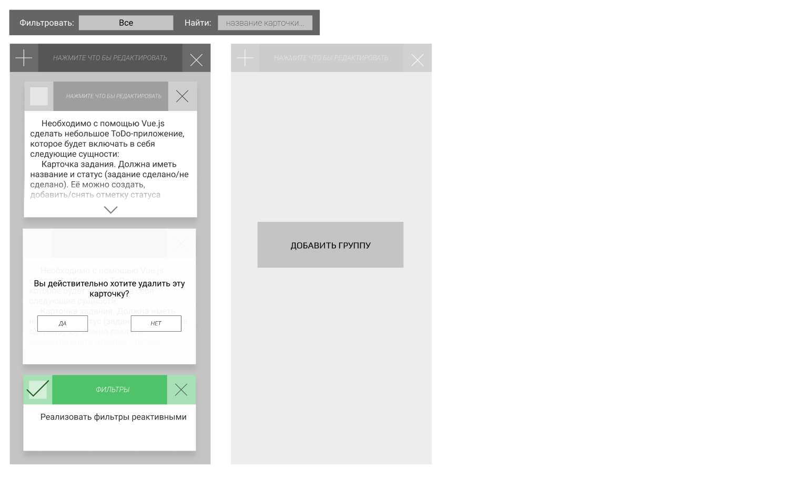
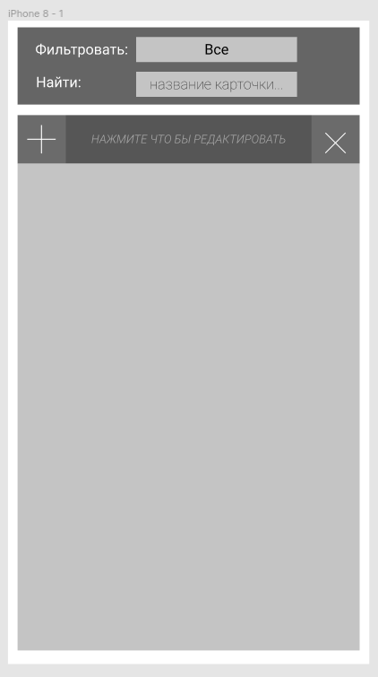

# Todoapp  
  
## Figma 

[Link](https://www.figma.com/file/uNr6pwcMVEDzbA0n3FnAc9/Untitled?node-id=0:1)
### Desktop version 
 
### Mobile version
 
## Project setup  
```  
npm install  
```  
  
### Compiles and hot-reloads for development  
```  
npm run serve  
```  
  
### Compiles and minifies for production  
```  
npm run build  
```  
  
### Lints and fixes files  
```  
npm run lint  
```  

Задание
Необходимо с помощью Vue.js сделать небольшое ToDo-приложение, которое будет включать в себя следующие сущности:
Карточка задания. Должна иметь название и статус (задание сделано/не сделано). Её можно создать, добавить/снять отметку статуса выполнения и удалить;
Группа карточек. Должна иметь название. Ей можно создать, в неё можно добавлять новые карточки, её можно удалить;
Фильтр по названию карточки (не должно быть чувствительным к регистру);
Фильтр по статусу выполнения карточки.

Дополнительно
Реализовать фильтры реактивными;
Диалоговое окно или иной элемент интерфейса для подтверждения действий удаления карточки или группы, реализовать без использования "alert", "prompt" и "confirm";
Описание задачи в карточке. Если текст не помещается в элементе, обрезать его и давать отдельную возможность раскрыть полностью;
Возможность перемещать карточки между группами;
Адаптивная вёрстка.

Требования
Все действия на странице должны происходить без ее перезагрузки;
Код должен быть написан понятно и аккуратно, с соблюдением табуляции и прочих элементов написания, без лишних элементов и функций, не имеющих отношения к функционалу тестового задания;
Читабельность и наличие элементарной архитектуры;
Верстка должна быть выполнена без использования UI библиотек.


